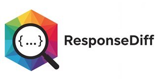

# responsediff-demo

This project provides a simple REST interface to illustrate the [ResponseDiff](https://github.com/kreutzr/responsediff) behavior in action.

You may run separate webservers (for reference, control and candidate) on different ports (e.g., 3000, 3001, 3002) with a simple directory structure as follows:
```
responsediff-demo/
├── server.js
├── package.json
└── public/
    ├──my-tool
    │  ├── person.json
    │  └── person.png
    └── text.txt
```

or use only one single webserver as follows:
```
responsediff-demo/
├── server.js
├── package.json
└── public/
    ├── v1.0.0                 # reference
    │    ├── my-tool
    │    │   ├── person.json
    │    │   └── person.png
    │    └── text.txt
    ├── v1.0.0-control         # control
    │    ├── my-tool
    │    │   ├── person.json
    │    │   └── person.png
    │    └── text.txt
    └── v2.0.0-control         # candidate
         ├── my-tool
         │   ├── person.json
         │   └── person.png
         └── text.txt
```

You will find a ready setup example in folder `regression`.

To simulate a login, this service provides a "/login" POST endpoint which will return a response as JSON (e.g., "{ 'uuid': '2869e288-eb05-4e16-be22-0af3c2308469' }").
The `login` endpoint is provided on root and first level.
```
curl -v -X POST http://localhost:3000/login
curl -v -X POST http://localhost:3000/v1.0.0/login
```

# How to get started
With having node.js installed simply call
```
node server.js
```

and run ResponseDiff against this webserver(s) from another console.

To stop the webserver(s) just press `Ctrl+C`.

Enjoy!
